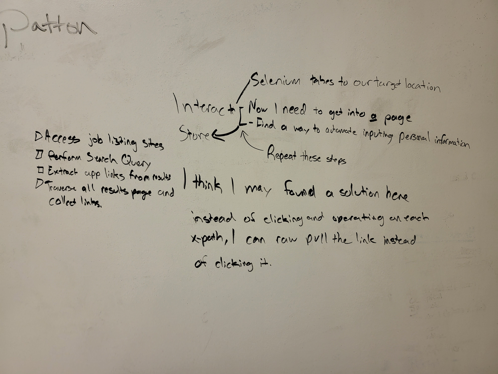

# Wabba jakka auto job appa

----------

This here will host my information reguarding the project for building out exactly what I need to get this thing up and running.

This project has a couple of different moving parts.
1. Something that logs into linked in.
    - That goes over to the jobs tab and works through each one of the entries.
2. To autofill job applications based on personal information needed to be processed.
    - It would also locally store a list of the company name as well as the postition.

I have found Selenium so far as a good library to be able to traverse the internet with.

Today on Aug 31 has been a wash/recovery day. It would be within my best interest to go and create this completely but at present I need to get a job, place to live, and college to further my career and asking price. Times feel uneasy but like my mom said to ask in any situation "what am I here to learn?"

That didn't go quite as planned lmao because my buddy Wilder came back from his deployment. We ended up hanging out quite a bit and he leaves on the 10th to go back to the meat grinder of a day job we often refer to as the military. He is my brother and gets priority while he is here. In the mean time I am going back to college for an Associate's in Computer Science to make myself more appealing and be able to pay rent through BAH. There is a free Harvard course available for what I want to be doing so that is going to be done when it can.
